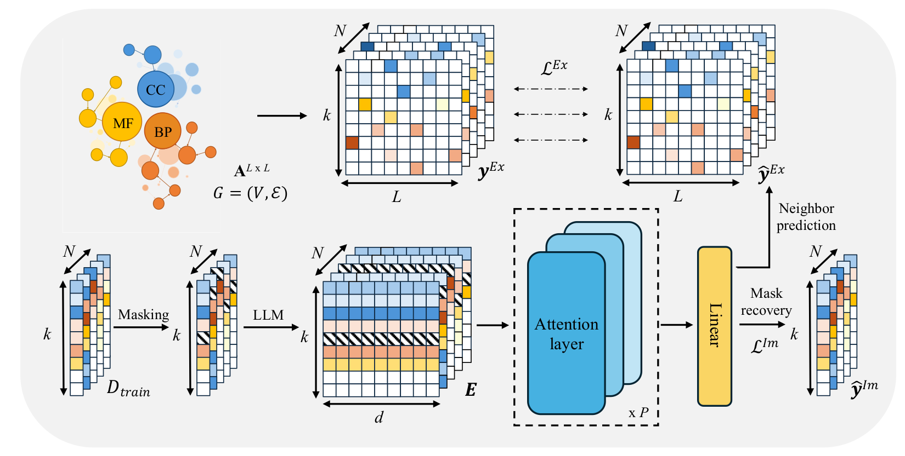

# GoBERT: Gene Ontology Graph Informed BERT for Universal Gene Function Prediction.

This repository is the official implementation of the paper "GoBERT: Gene Ontology Graph Informed BERT for Universal Gene Function Prediction."



## Quick Start

The pre-trained model checkpoint for reproducing our paper results is available on Hugging Face:
[MM-YY-WW/GoBERT](https://huggingface.co/MM-YY-WW/GoBERT/tree/main)

```python
from transformers import AutoTokenizer, BertForPreTraining

repo_name = "MM-YY-WW/GoBERT"
tokenizer = AutoTokenizer.from_pretrained(repo_name)
model = BertForPreTraining.from_pretrained(repo_name)
```

## Web Interface

We provide a [web interface](https://gobert.nasy.moe) for GoBERT function prediction.

## Usage Guide

### Function-Level Embeddings

To encode a set of GO functions for a gene and obtain function-level GoBERT embeddings:

1. Run `gobert_emb.py` with the following parameters:
   - `--input_file`: Path to a .txt file with GO IDs (space-separated) on each line (see [example/input_goids.txt](example/input_goids.txt))
   - `--gene_name_list`: Path to a .txt file with corresponding gene identifiers (see [example/input_gene_list.txt](example/input_gene_list.txt))
   - `--output_path`: Directory where embeddings will be saved (see [example/function_level_GoBERT_emb](example/function_level_GoBERT_emb))

Each gene's embedding will be saved as a pickle file named after the gene identifier.

## Reproducing Paper Results

### Environment Setup

```bash
conda create -n gobert_1 python=3.8
conda activate gobert_1
conda install pytorch==1.13.1 torchvision==0.14.1 torchaudio==0.13.1 pytorch-cuda=11.7 -c pytorch -c nvidia
pip install huggingface==0.0.1 scikit-learn obonet accelerate==1.0.1 datasets==3.0.1 tqdm pandas numpy transformers==4.46.3
```

### Evaluation

1. Download [model checkpoints](URL_TO_BE_ADDED) and unzip them
2. Example evaluation results can be found at `ckpt/evaluation_result/test_results.log`
3. Run evaluation:
   ```bash
   ./script/evaluation.sh
   ```

## Citation

```bibtex
@inproceedings{miao2025gobert,
  title={GoBERT: Gene Ontology Graph Informed BERT for Universal Gene Function Prediction},
  author={Miao, Yuwei and Guo, Yuzhi and Ma, Hehuan and Yan, Jingquan and Jiang, Feng and Liao, Rui and Huang, Junzhou},
  booktitle={Proceedings of the AAAI Conference on Artificial Intelligence},
  volume={39},
  number={1},
  pages={622--630},
  year={2025},
  doi={10.1609/aaai.v39i1.32043}
}
```